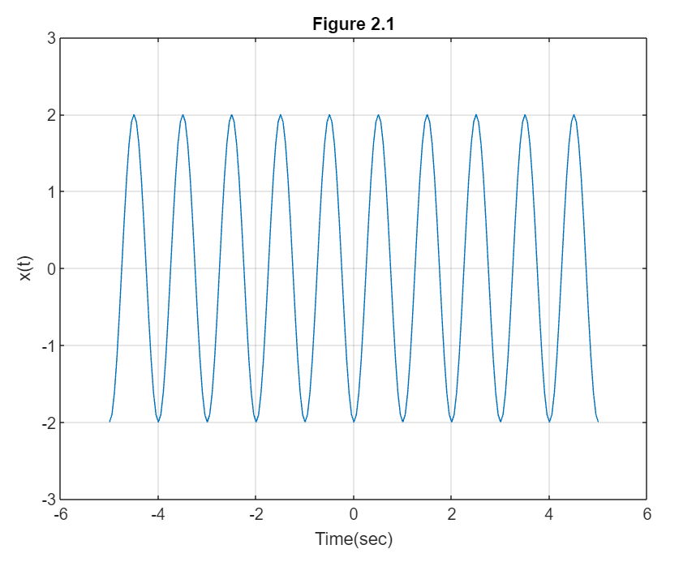
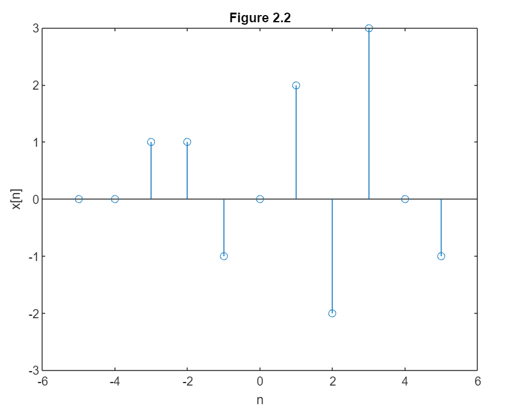

# Digital-Signal-Processing-Lab

This repository contains MATLAB scripts for various signal-processing experiments. Each experiment demonstrates different aspects of signal processing techniques, such as plotting, generating, time-scaling, convolution, and more.

## Experiment 1: Plotting Sin and Cos Waves Overlapping

Experiment demonstrating plotting Sin and Cos waves overlapping using MATLAB's `plot` and `stem` functions.
```m
x = 0:0.1:10;
y = sin (x);
z = cos (x);
subplot (3,1,1);
plot (x,y,'b');
grid on;
xlabel("x");
ylabel("y=sin(x)");
subplot (3,1,2);
plot (x,z,'r');
grid on; 
xlabel("x");
ylabel("z=cos(x)");
subplot (3,1,3);
stem (x,z,'r');
grid on;
hold on;
subplot (3,1,3);
stem (x,y,'b');
xlabel("x");
ylabel("y=sin(x), z=cos(x)");
```
### Output:


## Experiment 2: Generating a Continuous Signal

Experiment demonstrating the generation and plotting of a continuous signal.
```m
%2sin(2πτ-π/2)
T = -5:0.05:5;
x = 2*sin((2*pi*T) - (pi/2));
plot (T,x);
grid on;
axis ([-6 6 -3 3])
ylabel ('x(t)')
xlabel ('Time(sec)')
title ('Figure 2.1')
```
### Output:


## Experiment 3: Generating a Discrete Signal

Experiment demonstrating the generation and plotting of a discrete signal.
```m
% Generation of discrete time signals 
n = -5:5;
x = [0 0 1 1 -1 0 2 -2 3 0 -1];
stem (n,x);
axis ([-6 6 -3 3]);
xlabel ('n'); 
ylabel ('x[n]'); 
title ('Figure 2.2');
```
### Output:


## Experiment 4: Generating a Random Signal

Experiment demonstrating the generation and plotting of random sequences.
```m
% Generation of random sequences
n = [0:10];
x = rand (1, length (n));
y = randn (1, length (n));
plot (n,x) ;
grid on;
hold on;
plot(n,y,'r');
ylabel ('x & y')
xlabel ('n')
title ('Figure 2.3');
```
### Output:


## Experiment 5: Generating a Discrete Periodic Signal

Experiment demonstrating the generation and plotting of a discrete periodic signal.
```m
n = 0:4;
x = [1 1 2 -1 0];
subplot (2,1,1);
stem (n,x);
grid on;
axis ([-1 15 -1 2]);
xlabel ('n');
ylabel ('x(n)');
title ('Figure 2.4(a)');

xtilde = [x,x,x];
length_xtilde = length (xtilde);
n_new = 0:length_xtilde-1;
subplot (2,1,2);
stem (n_new, xtilde,'r');
grid on;
axis ([-1 length_xtilde -1 2]);
xlabel ('n');
ylabel ('perodic x(n)');
title ('Figure 2.4(b)');
```
### Output:


## Experiment 6: Generating Square Wave Using Loop

Experiment demonstrating the generation and plotting of a square wave using loops.
```m
clear;
clc;
n = input ('Insert the value of odd n:');
t = 0:.001:1;
sum = 0;
for f = 1:2:n
    w = sin (2 * pi * f * t);
    sum = sum + w;
end
subplot(1,1,1)
plot(t,sum)
grid on;
xlabel ('Time');
ylabel ('Amplitude');
title ('Square Wave');
```
### Output:


## Experiment 7: Generating Unit Step Discrete Time Signal

Experiment demonstrating the generation and plotting of a unit step discrete time signal.
```m
clc;
clear all;
close all;

N= input('Enter the range: ');
n= -N:1:N;
y= [zeros(1,N),1,ones(1,N)];
stem(n,y);
grid on;
axis([-(N+1) N+1 -0.5 1.5]); % [-x x -y y]
xlabel('Time');
ylabel('Amplitude of Y');
title('Generating Unit Step Function');
```
### Output:


## Experiment 8: Generating Unit Impulse Signal

Experiment demonstrating different methods to generate and plot a unit impulse signal.
```m
clc;
clear all;
m1 = input('Enter the value of x-axis in negative side:');
m2 = input('Enter the value of x-axis in positive side:');
n = m1:m2;
x = (n==0);%it works as if statement like n=-5:5( 0 0 0 0 0 1 0 0 0 0 0 0)
stem(n,x);
xlabel('n');
ylabel('amplitude');
title('Unit impulse signal');
```
The unit impulse can be implemented in different way:
```m
clc;
clear all;
close all;
m1 = input('Enter the value of x-axis in negative side:');
m2 = input('Enter the value of x-axis in positive side:');
n = -m1:1:m2;
d = [zeros(1,m1), 1 ,zeros(1,m2)];
stem(n,d);
axis([-m1, m2, -0.5, 1.5])
xlabel('n');
ylabel('Amplitude of Y');
title('Unit impulse signal');
```
### Output:


## Experiment 9: Generating and Plotting Ramp Discrete Time Signal

Experiment demonstrating the generation and plotting of a ramp discrete time signal.
```m
close all;
clear all;
clc;

n1 = input ('Enter lower limit'); %-5
n2 = input ('Enter upper limit'); %5
n = n1: 1: n2;
x = n.*[n>=0];
stem (n, x, 'b');
axis([(n1-1) (n2+1) -1 (n2+1)]);   % -x,x,-y,y
title ('Ramp Function');
xlabel ('Time');
ylabel ('Amplitude of Y');
grid on;
```
### Output:


## Experiment 10: Time Reversal of Discrete Sinusoidal Function

Experiment demonstrating time reversal of a discrete sinusoidal function using radians for time values.
```m
%close all
%clc
 
t1 = 0:0.2:2*pi; %values of x-axis in radian
x1 = sin(t1);    %values of y-axis
x2 = fliplr(x1); %fliplr() -> this function gives the flipped result; 
                 %lr means left right ...flipud() ud means up down 
t2 = -fliplr(t1); % time values must be flipped and negated
subplot(2,1,1)
stem(t1,x1,'LineWidth',2)
xlim([-10 10])
title('Original Signal') %\bf\fontsize{25}
xlabel('Samples (t)')
ylabel('Amplitude (sin(t))')
grid on;
ax = gca;
ax.XAxis.FontSize = 15;
ax.XAxis.FontWeight = 'bold';
ax.YAxis.FontSize = 15;
ax.YAxis.FontWeight = 'bold';
 
subplot(2,1,2)
stem(t2,x2,'LineWidth',2)
xlim([-10 10])
title('Time Reversed Signal')
xlabel('Samples')
ylabel('Amplitude')
grid on;
ax = gca;
ax.XAxis.FontSize = 15;
ax.XAxis.FontWeight = 'bold';
ax.YAxis.FontSize = 15;
ax.YAxis.FontWeight = 'bold';
```
### Output:


## Experiment 11: Time Reversal of Discrete Sinusoidal Function

Experiment demonstrating time reversal of a discrete sinusoidal function using degrees for time values.
```m
close all
clc
 
t1=0:10:360; %values of x-axis in degree
x1=sind(t1); % values of y axis
x2=fliplr(x1); %fliplr() -> this function gives the flippefd result; 
               %lr means left right ...flipud() ud means up down 
t2= -fliplr(t1); % time values must be flipped and negated
 
subplot(2,1,1)
stem(t1,x1,'LineWidth',2)
xlim([-400 400])
ylim([-1.5 1.5])
title('Original Signal')
xlabel('Samples')
ylabel('Amplitude')
grid on;
ax = gca;
ax.XAxis.FontSize = 15;
ax.XAxis.FontWeight = 'bold';
ax.YAxis.FontSize = 15;
ax.YAxis.FontWeight = 'bold';
 
subplot(212)
stem(t2,x2,'LineWidth',2)
xlim([-400 400])
ylim([-1.5 1.5])
title('Time Reversed Signal') %\bf\fontsize{25}
xlabel('Samples')
ylabel('Amplitude')
grid on;
ax = gca;
ax.XAxis.FontSize = 15;
ax.XAxis.FontWeight = 'bold';
ax.YAxis.FontSize = 15;
ax.YAxis.FontWeight = 'bold';
```
### Output:


## Experiment 12: Signal Addition

Experiment demonstrating addition of two signals using MATLAB.
```m
clear all;
clc;
x1=[-5 -4 -3 -2 -1 0];
y1=[2 5 4 6 3 5];
x2=[-2 -1 0 1 2];
y2=[8 9 2 5 6];
 
% Draw the second signal.
subplot(3,1,1);
stem(x1,y1);
grid on;
grid minor;
axis([-10 10 -8 8]);
 
% Draw the second signal.
subplot(3,1,2);
stem(x2,y2);
grid on;
grid minor;
axis([-10 10 -2 16]);
n=min(min(x1),min(x2)):1:max(max(x1),max(x2));
 
% This function is for the addition the two signal .
[y] = add_function(n,x1,x2,y1,y2);
 
% This is for the plot the added signal.
subplot(3,1,3);
stem(n,y);
grid on;
grid minor;
axis([-10 10 -2 16]);


function[y] = add_function(n,x1,x2,y1,y2)
 
m1=zeros(1,length(n));
m2=zeros(1,length(n));
temp=1;
for i=1:length(n)
    if(n(i)>=min(x1) & n(i)<=max(x1))
        m1(i)=y1(temp);
        temp=temp+1;
    else
        m1(i)=0;
    end
end
temp=1;
for i=1:length(n)
    if(n(i)>=min(x2) & n(i)<=max(x2))
        m2(i)=y2(temp);
        temp=temp+1;
    else
        m2(i)=0;
    end
end
 
y=m1+m2;
end
```
### Output:


## Experiment 13: Signal Multiplication

Experiment demonstrating multiplication of two signals using MATLAB.
```m
clc;
clear all;
close all;
 
x1=[0:0.1:10];
y1=sin(x1);
x2=[-5:0.1:7];
y2=4*sin(x2);
 
% This plot is for the plotting the graph of (x1,y1).
subplot(3,1,1);
stem(x1,y1);
grid on;
grid minor;
axis([-5 10 -5 5]);
 
% This plot is for the plotting the graph of (x2,y2);
subplot(3,1,2);
stem(x2,y2);
grid on;
grid minor;
axis([-5 10 -5 5]);
 
% This line is use for find out the new range of the signal.
n=min(min(x1),min(x2)):0.1:max(max(x1),max(x2));
 
[m]=mul_function(n,x1,y1,x2,y2);
 
%This plot is for the plotting the graph of (n,y) multiplicated signal.
subplot(3,1,3);
stem(n,m,'r');
grid on;
grid minor;
axis([-5 10 -5 5]);


function[m]=mul_function(n,x1,y1,x2,y2)
 
m1=zeros(1,length(n));
m2=m1;
 
% This loop is use for the fill the loop m1.
temp=1;
for i=1:length(n)
    if(n(i)>=min(x1) & n(i)<=max(x1))
        m1(i)=y1(temp);
        temp=temp+1;
    else
        m1(i)=0;
    end
end
 
% This loop is use for the fill the loop m2.
temp=1;
for i=1:length(n)
    if(n(i)>=min(x2) & n(i)<=max(x2))
        m2(i)=y2(temp);
        temp=temp+1;
    else
        m2(i)=0;
    end
end
m=m1.*m2;
end
```
### Output:


## Experiment 14: Time Scaling for the sketch y[n]=x[n/2]

Experiment demonstrating time scaling of a signal.
```m
close all;
clear all;
clc;

start_value = input('Enter the start value: ');%-6
end_value = input('Enter the end value: ');%6

n1 = start_value:end_value;

y=input("Enter the values of signal = "); %[1 0.5 1 0.5 1 0.5 1 0.5 1 0.5 1 0.5 1]

index=1;

n2=(2*start_value):(2*end_value);

value = 2;
for i=1:length(n2)
    x1(i)=n2(i);
    if(rem(n2(i),value)==0)
        y1(i)=y(index);
        index=index+1;
    else
        y1(i)=0;
    end
end

subplot(2,1,1);
stem(n1,y,'r');
xlabel("Time");
ylabel("Amplitude");
grid on;
grid minor;
axis([(start_value-1) (end_value+1) -2 2]);
title("Original signal Y[n]=X[n]");


subplot(2,1,2);
stem(x1,y1,'b');
xlabel("Time");
ylabel("Amplitude");
grid on;
grid minor;
axis([(2*start_value-1) (2*end_value+1) -2 2]);
title("Compresion signal Y[n]=X[n/2]");
```
### Output:


### Time Scaling Ex 2: Find y[n]=x[2n] and y[n]=x[n/2]
```m
close all;
clear all;
clc;
n=-6:6;
y=[1 0.5 1 0.5 1 0.5 1 0.5 1 0.5 1 0.5 1];
   
index=1;
value1=2;
for i=1:length(n)
    if(rem(n(i),value1)==0)
        x1(index)=n(i)./value1;
        y1(index)=y(i);
        index=index+1;
    end
end
subplot(3,1,1);
stem(n,y);
xlabel("Time domain");
ylabel("Amplitude");
grid on;
axis([-8 8 -0.5 1.5]);
title("Original signal X[n]");

subplot(3,1,2);
stem(x1,y1,'r');
xlabel("Time domain");
ylabel("Amplitude");
grid on;
grid minor;
axis([-8 8 -0.5 1.5]);
title("Compresion signal Y[n] = X[2n]");

index=1;
n2=-12:12;
value2=2;
for i=1:length(n2)
    x1(i)=n2(i);
    if(rem(n2(i),value2)==0)
        y1(i)=y(index);
        index=index+1;
    else
        y1(i)=0;
    end
end
subplot(3,1,3);
stem(x1,y1,'b');
xlabel("Time domain");
ylabel("Amplitude");
grid on;
grid minor;
axis([-13 13 -0.5 1.5]);
title("Expanding signal Y[n] = X[n/2]");
```
### Output:


## Experiment 15: Time Shifted Signals of Sketch the signal x[n], y[n]=x[n-4] and x[n+4], derived from x[n]

Experiment demonstrating time shifting of a signal.
```m
clc;
clear;
 
n = -5:5;
x = [0 -1 -.5 .5 1 1 1 1 .5 0 0];
subplot(3,1,1);
stem (n,x);
xlabel('Time Sample');
ylabel('Amplitude');
title('Original Signal');
axis([-7 7 min(x)-2 max(x)+2]);
grid on;
grid minor;
 
m = n+4; 
subplot(3,1,2);
stem (m,x);
xlabel('Time Sample');
ylabel('Amplitude');
title('Time right shifted signal');
axis([-7-2+4 7+2+4 min(x)-2 max(x)+2]);
grid on;
grid minor;

l = n-4; 
subplot(3,1,3);
stem (l,x);
xlabel('Time Sample');

ylabel('Amplitude');
title('Time left shifted signal');
axis([-7-2-4 7+2-4 min(x)-2 max(x)+2]);
grid on;
grid minor;
```
### Output:


## Experiment 16: Decomposition of Signal into Even and Odd Components

Experiment demonstrating decomposition of a signal into even and odd components.
```m
n = -2:2;
x = [5,6,3,4,1];

% Creating mirrored versions for negative indices
x_mirror = fliplr(x); %x_mirror = [1,4,3,5,5]

% even and odd components
xe = (x + x_mirror) / 2; %xe= ( x(n)+x(-n) )/2;
xo = (x - x_mirror) / 2; %xo= ( x(n)-x(-n) )/2;

% Plotting
subplot(4,1,1);
stem(n, x); 
grid on; 
axis([-3 3 -1 7]);
xlabel('n'); 
ylabel('Amplitude'); 
title('Original Signal');

subplot(4,1,2);
stem(n, x_mirror); 
grid on; 
axis([-3 3 -1 7]);
xlabel('n'); 
ylabel('Amplitude'); 
title('Reversed Signal');

subplot(4,1,3); 
stem(n, xe, 'b'); 
grid on; 
axis([-3 3 -1 6]);
xlabel('n'); 
ylabel('Amplitude'); 
title('Even Signal');

subplot(4,1,4); 
stem(n, xo, 'b'); 
grid on; 
axis([-3 3 -3 3]);
xlabel('n'); 
ylabel('Amplitude'); 
title('Odd Signal');
```
### Output:


## Experiment 17: Discrete Time Signal Transformation (Precedence Rule - Shifting and Scaling)

Experiment demonstrating transformation of a discrete time signal.
```m
clc;
close all;

%orginal signal
n=-6:6;
y=[0 0 0 0 -1 -2 0 2 1 0 0 0 0];
subplot(3,1,1);
stem(n,y);
grid on;
axis([-8 8 -2 2]);
xlabel('n');
ylabel('amplitude ');
title('x[n]');

%shifting the given signal
n1=n-3;
subplot(3,1,2);
stem(n1,y);
grid on;
axis([-8 8 -2 2]);
xlabel('n');
ylabel('amplitude');
title('x[n+3]');

index=1;
for i=1:length(n1)
    if(rem(n1(i), 2)== 0)
        x1(index)=n1(i) / 2;
        y1(index)=y(i);
        index=index+1;
    end

end

%final signal
subplot(3,1,3);
stem(x1,y1);
grid on;
axis([-8 8 -2 2]);
xlabel('n');
ylabel('amplitude');
title('y[n] = x[2n+3]');
```
### Output:


## Experiment 18: Shifting Signals y[n]=x[n-3] and z[n]=x[n+2]

Experiment demonstrating shifting of signals.
```m
%y[n]=x[n-3] and z[n]=x[n+2]
clc;
close all;

%orginal signal
n=-3:3;
y=[-2 0 1 -3 2 -1 3];
subplot(3,1,1);
stem(n,y);
grid on;
axis([-6 7 -4 4]);
xlabel('n');
ylabel('amplitude ');
title('x[n]');

%shifting the given signal
n1=n+3;
subplot(3,1,2);
stem(n1,y);
grid on;
axis([-6 7 -4 4]);
xlabel('n');
ylabel('amplitude');
title('y[n] = x[n-3]');

%shifting the given signal
n2=n-2;
subplot(3,1,3);
stem(n2,y);
grid on;
axis([-6 7 -4 4]);
xlabel('n');
ylabel('amplitude');
title('z[n] = x[n+2]');
```
### Output:


## Experiment 19: Convolution of Signals

Experiment demonstrating convolution of two signals.
```m
clc;
clear all;
close all;

x1=[-1 0 1 2 3 4 5];
y1=[-1 0.5 1 -0.5 0 0 0];
x2=[0 1 2 3 4 5];
h=[0.5 1 -0.5 0.5 0 0];

[n,y]=func_convalution(x1,y1,x2,h);

subplot(3,1,1);
stem(x1,y1);
xlabel('X1');
ylabel('Y1');
title("Given Signal");

subplot(3,1,2);
stem(x2,h);
xlabel('x2');
ylabel('h');
title("Impulse Response");

subplot(3,1,3);
stem(n,y);
xlabel('n');
ylabel('y');
title("Convalution Sum");

function[n , y]=func_convalution(x1,y1,x2,h)
m1=min(x1)+min(x2);
m2=max(x1)+max(x2);

n=m1:m2;
y=conv(y1,h); % build in function s
end
```
### Output:


## Experiment 20: Sinc Function

Experiment demonstrating the sinc function.
```m
x = -5:0.1:5;

% Compute sinc(x) while handling division by zero at x = 0
y = sin(x);
z = ones(size(x));  % Initialize z with ones to handle division by zero
idx = find(x ~= 0); % Find indices where x is not equal to 0
z(idx) = y(idx) ./ x(idx); % Compute sinc(x) for non-zero x

% Plotting
subplot(2,1,1);
plot(x, y, 'b');
grid on;
xlabel("x");
ylabel("y = sin(x)");

subplot(2,1,2);
plot(x, z, 'r');
grid on;
xlabel("x");
ylabel("z = sinc(x)");
```
### Output:


## Experiment 21: Aliasing Effect

Experiment demonstrating the aliasing effect.
```m
clc;
clear all;
close all;
 
frequency =input('Enter the frequency for the signal:\n');
fprintf("Enter the  frequency and it must be greater or less than Nyquist frequency\n");
oversampling=input('');
%fprintf("Enter the UnderSampling frequency and it must be Less than %d\n",2*frequency);
%undersampling=input('');

Time_Period = 1/frequency;
 
tmin=-0.05;
tmax=0.05;

time = linspace(tmin,tmax,400);
amplitude = cos(2*pi*frequency*time);
 
subplot(4,1,1);
plot(time,amplitude);
grid on; grid minor;
xlabel("Time");
ylabel("Amplitude");
title("orginal Signal");

%Nyquist rate Sampling Part.
nyquist_frequency = 2*frequency;
time1=tmin:(1/nyquist_frequency):tmax;
amplitude1 = cos(2*pi*frequency*time1);
subplot(4,1,2);
plot(time,amplitude);
hold on;
grid on; grid minor;
plot(time1,amplitude1);
title("NyQuist Sampling");
hold off;

if oversampling>nyquist_frequency
    %OverSampling Part.
    time1=tmin:(1/oversampling):tmax;
    amplitude1 = cos(2*pi*frequency*time1);
    subplot(4,1,3);
    plot(time,amplitude);
    hold on;
    plot(time1,amplitude1);
    grid on; grid minor;
    xlabel("Time");
    ylabel("Amplitude");
    title("OverSampling");
    hold off;
else
    %OverSampling Part.
    time1=tmin:(1/oversampling):tmax;
    amplitude1 = cos(2*pi*frequency*time1);
    subplot(4,1,3);
    plot(time,amplitude);
    hold on;
    plot(time1,amplitude1);
    grid on; grid minor;
    xlabel("Time");
    ylabel("Amplitude");
    title("UnderSampling");
    hold off;
end
```
### Output:

